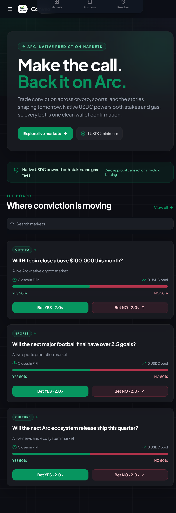
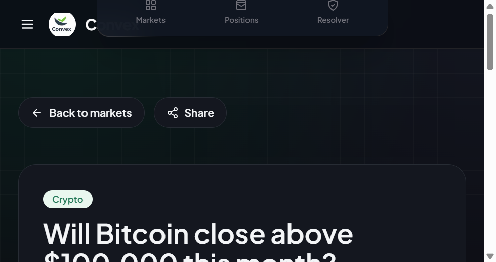

# Convex - Arc-Native Prediction Markets

Convex is a decentralized prediction market protocol built natively on Arc Mainnet. It enables users to create markets, stake conviction in native USDC, and earn pool-based rewards with zero token approval friction.

## Arc Microgrants Proof of Concept

Convex fulfills the Arc Microgrants criteria as a fully functional, live dApp deployed on Arc Mainnet:
- Live Arc Mainnet Deployment: Deployed on Chain ID 5042.
- Native USDC Gas Model: Uses native USDC for both gas fees and market staking.
- One-Click Staking: Eliminates ERC-20 approval transactions for frictionless user experience.
- On-Chain Resolution: Market lifecycle and payout distributions are managed directly via smart contracts.

## Production Contracts (Arc Mainnet)

- Network: Arc Mainnet
- Chain ID: 5042
- RPC URL: [https://rpc.mainnet.arc.io](https://rpc.mainnet.arc.io)
- Native Currency: USDC
- ConvexMarketManager Contract: 0xd59A8fdf194F41fFb46888d63909F298DF600F30
- Explorer: https://explorer.arc.io

## Key Application Features

- Zero-Approval Staking: Direct value transfers via msg.value utilizing Arc native USDC.
- Dynamic Pool Mechanics: Pari-mutuel pool distribution where odds update in real time based on staked conviction.
- Market Lifecycle Management: Automated state progression from Live to Closed to Resolved.
- Responsive UI: High-contrast, glassmorphic Web3 interface optimized for desktop and mobile wallets.

## Screenshots

## System Architecture

Web Frontend (Next.js 14)
  |
  |--- wagmi + RainbowKit (Arc Mainnet)
  v
Arc Blockchain (Chain ID 5042)
  |
  +--> ConvexMarketManager.sol (Factory, Staking Pool, Payouts)

## Smart Contract Overview

ConvexMarketManager.sol handles the complete market lifecycle:
- createMarket: Initializes new prediction markets with metadata hash, close time, and fee parameters.
- stake: Accepts native USDC transfers for YES or NO outcomes without prior token approval.
- resolveMarket: Sets winning outcome (restricted to RESOLVER_ROLE).
- claim: Calculates proportional payout share and transfers native USDC directly to winners.

## Local Development Setup

Prerequisites:
- Node.js v18+
- pnpm v8+
- MetaMask or Web3 Wallet configured for Arc Mainnet (Chain ID 5042)

1. Clone and Install Dependencies:
   git clone <YOUR_NEW_REPO_URL>
   cd convex
   pnpm install

2. Configure Environment Variables (apps/web/.env.local):
   NEXT_PUBLIC_MANAGER_ADDRESS=0xd59A8fdf194F41fFb46888d63909F298DF600F30
   NEXT_PUBLIC_RPC_URL=https://rpc.mainnet.arc.io
   NEXT_PUBLIC_CHAIN_ID=5042

3. Run Development Server:
   pnpm --filter web dev

Open http://localhost:3000 to interact with the application.

## Contract Deployment to Arc Mainnet

To deploy the smart contracts to Arc Mainnet:
1. Configure private key in apps/contracts/.env:
   PRIVATE_KEY=your_private_key
   TREASURY_ADDRESS=your_treasury_address
2. Run deployment command:
   pnpm --filter hardhat deploy:arc

## License

This project is open-source software licensed under the MIT License.
